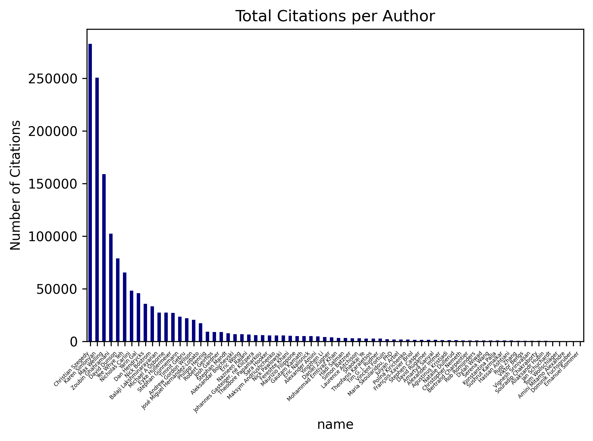
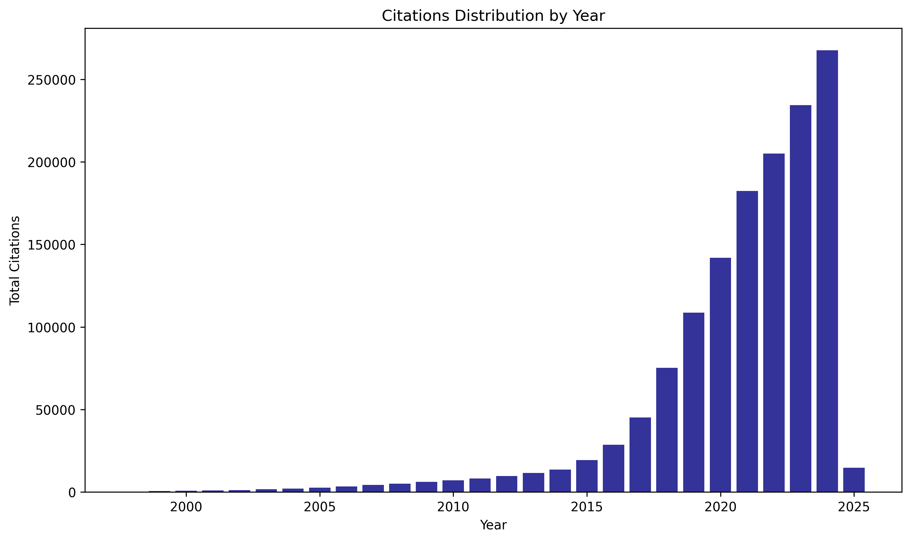
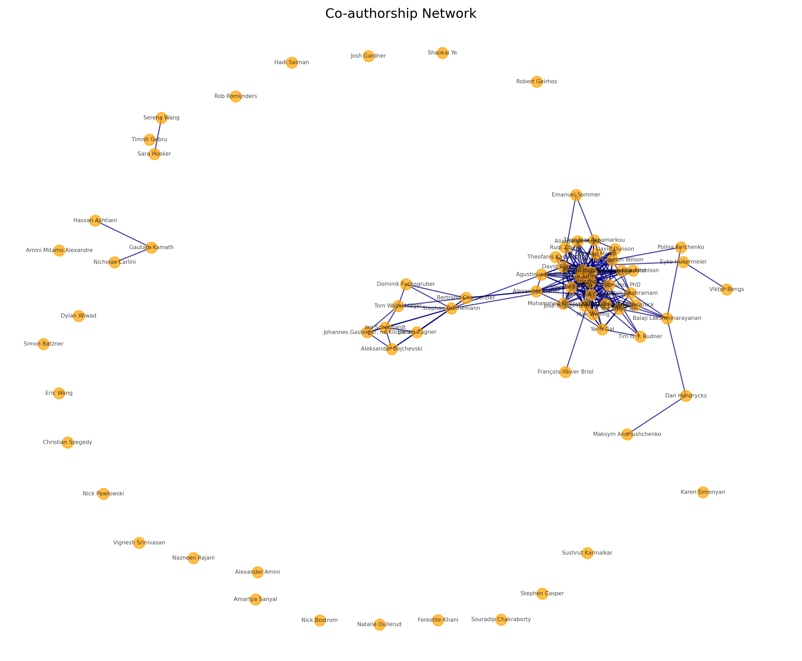

# 🌟 Awesome AI Reliability 🌟

 

A curated list of resources about Machine Learning (ML) reliability. It covers trustworthiness of ML systems by including resources on the topics listed below and more! You can expect this repository to become more and more complete with time :)

### Topics Summary 🎨

| Topic            | Description                                    | Badge Example                                          |
|-------------------|------------------------------------------------|-------------------------------------------------------|
| **Uncertainty**   | Quantifying and managing uncertainty           |  |
| **Bayesian**      | Bayesian approaches to ML                      |  |
| **Robustness**    | Ensuring robustness to various conditions      |  |
| **Attack**       | Exploring adversarial attacks                  |  |
| **Defense**       | Defense mechanisms against vulnerabilities     |  |
| **Privacy**       | Addressing privacy concerns in ML systems      |  |
| **Fairness**      | Ensuring fairness and equity in AI             |  |
| **Explainability**| Improving interpretability of AI systems       |  |

If you find this list helpful, give it a ⭐ on GitHub, share it, and feel free to contribute by submitting a pull request or issue!

---

## Table of Contents
- [Facts/Numbers 📊](#factsnumbers-📊)
- [Tools 🛠️](#tools-🛠️)
- [Newspaper Articles 📰](#newspaper-articles-📰)
- [Blog Articles 🗒️](#blog-articles-🗒️)
- [Research Articles 🕌](#research-articles-🕌)
- [Books 📚](#books-📚)
- [Lectures 🎓](#lectures-🎓)
- [People 🧑‍💻](#people-🧑‍💻)

---

## Facts 📊
- **Hundreds of millions**: Number of people interacting with AI models ([Source](https://arxiv.org/abs/2405.01470), 2024, [Source](https://arxiv.org/abs/2309.11998), 2024)
- **80%**: Percentage of ML projects that fail due to issues with data quality and system reliability ([Source](https://www.tomshardware.com/tech-industry/artificial-intelligence/research-shows-more-than-80-of-ai-projects-fail-wasting-billions-of-dollars-in-capital-and-resources-report), 2024).
- **60%**: Percentage of businesses using AI but which aren't developing ethical AI policies ([Source](https://www.venasolutions.com/blog/ai-statistics), 2024).
- **10,000+**: Research papers on ML robustness ([Source](https://nicholas.carlini.com/writing/2019/all-adversarial-example-papers.html), 2024).

---

## Tools 🛠️
- **[Uncertainty Baselines](https://github.com/google/uncertainty-baselines)**: High-quality implementations of standard and SOTA methods on a variety of tasks.
- **[Uncertainty Toolbox](https://uncertainty-toolbox.github.io/)**: A Python toolbox for predictive uncertainty quantification, calibration, metrics, and visualization.
- **[RobustBench](https://robustbench.github.io/)**: A standardized benchmark for adversarial robustness.
- **[TorchMetrics](https://lightning.ai/docs/torchmetrics/stable/)**: A collection of 100+ PyTorch metrics implementations and an easy-to-use API to create custom metrics.
- **[Cleanlab](https://github.com/cleanlab/cleanlab)**: A Python library for finding and fixing label errors in datasets.
- **[DeepChecks](https://github.com/deepchecks/deepchecks)**: Comprehensive library for testing ML systems and datasets.
- **[Laplace](https://github.com/AlexImmer/Laplace/)**: Flexible library for Laplace approximation for neural networks.
- **[Crepes](https://github.com/henrikbostrom/crepes)**: Python package for conformal prediction that implements conformal classifiers, regressors, and predictive systems on top of any standard classifier and regressor.

---

## Newspaper Articles 📰
- *"[Research shows more than 80% of AI projects fail, wasting billions of dollars in capital and resources: Report
](https://www.tomshardware.com/tech-industry/artificial-intelligence/research-shows-more-than-80-of-ai-projects-fail-wasting-billions-of-dollars-in-capital-and-resources-report)"* (2024) - [Tom's Hardware](https://www.tomshardware.com/)
- *"[80 AI Statistics Shaping Business in 2024](https://www.venasolutions.com/blog/ai-statistics)"* (2024) - [Vena Solutions](https://www.venasolutions.com/)
- *"[OopsGPT](https://www.theatlantic.com/technology/archive/2024/07/searchgpt-openai-error/679248/?)"* (2024) - [The Atlantic](https://www.theatlantic.com/world/)

---

## Blog Articles 📝
- *"[A Complete List of All (arXiv) Adversarial Example Papers](https://nicholas.carlini.com/writing/2019/all-adversarial-example-papers.html)"* (Maintained)    - [Nicholas Carlini](https://nicholas.carlini.com/)
- *"[Adversarial Machine Learning Reading List](https://nicholas.carlini.com/writing/2018/adversarial-machine-learning-reading-list.html)"* (2019)    - [Nicholas Carlini](https://nicholas.carlini.com/)

---

## Research Articles 📄
- *"Connecting the Dots: Is Mode-Connectedness the Key to Feasible Sample-Based Inference in Bayesian Neural Networks?"* (2024)   - ICML
- *"Position: Bayesian Deep Learning is Needed in the Age of Large-Scale AI"* (2024)   - ICML
- *"Bayesian Semi-structured Subspace Inference"* (2024)   - AISTATS
- *"AI generates covertly racist decisions about people based on their dialect"* (2024)  - Nature
- *"Training, Architecture, and Prior for Deterministic Uncertainty Methods?"* (2023)   - TrustML - ICLR
- *"Revisiting uncertainty estimation for node classification: New benchmark and insights"* (2023)  - OpenReview
- *"On second-order scoring rules for epistemic uncertainty quantification"* (2023)  - ArXiv
- *"Disentangling epistemic and aleatoric uncertainty in reinforcement learning"* (2022)   - DFUQ - ICML
- *"Towards OOD detection in graph classification from uncertainty estimation perspective"* (2022)  - ArXiv
- *"Pitfalls of epistemic uncertainty quantification through loss minimisation"* (2022)  - NeurIPS
- *"Distributional Reinforcement Learning"* (2022)  - MIT Press
- *"Deep ensembles work, but are they necessary?"* (2022)   - NeurIPS
- *"On the robustness and anomaly detection of sparse neural networks"* (2022)  - SNN Workshop
- *"Natural posterior network: Deep Bayesian predictive uncertainty for exponential family distributions"* (2021)   - ICLR
- *"A review of uncertainty quantification in deep learning: Techniques, applications and challenges"* (2021)  - Information Fusion
- *"Graph posterior network: Bayesian predictive uncertainty for node classification"* (2021)   - NeurIPS
- *"A gentle introduction to conformal prediction and distribution-free uncertainty quantification"* (2021)  - ArXiv
- *"Adversarial attack for uncertainty estimation: Identifying critical regions in neural networks"* (2021)   - Neural Processing Letters
- *"Matérn Gaussian Processes on Graphs"* (2021)  - AISTATS
- *"Privacy Issues of AI"* (2021)  - Springer
- *"Getting a {clue}: A method for explaining uncertainty estimates"* (2021)   - ICLR
- *"Evaluating robustness of predictive uncertainty estimation: Are Dirichlet-based models reliable?"* (2020)     - ICML
- *"Deep evidential regression"* (2020)  - NeurIPS
- *"Posterior network: Uncertainty estimation without OOD samples via density-based pseudo-counts"* (2020)   - NeurIPS
- *"Efficient robustness certificates for discrete data: Sparsity-aware randomized smoothing for graphs, images and more"* (2020)  - ICML
- *"Provable worst case guarantees for the detection of out-of-distribution data"* (2020)  - NeurIPS
- *"Cold posteriors and aleatoric uncertainty"* (2020)   - ArXiv
- *"Uncertainty on asynchronous time event prediction"* (2019)  - NeurIPS
- *"Uncertainty-based continual learning with adaptive regularization"* (2019)  - NeurIPS
- *"Certifiable robustness to graph perturbations"* (2019)  - NeurIPS
- *"Explainable artificial intelligence (XAI): Concepts, taxonomies, opportunities and challenges toward responsible AI"* (2019)  - Information Fusion
- *"Bayesian robust attributed graph clustering: Joint learning of partial anomalies and group structure"* (2018)   - AAAI
- *"BayesGrad: Explaining predictions of graph convolutional networks"* (2018)   - NeurIPS
- *"Concerns about human agency, evolution and survival"* (2018)  - Pew Research
- *"Deep Gaussian embedding of graphs: Unsupervised inductive learning via ranking"* (2017)  - ArXiv
- *"Variational inference: A review for statisticians"* (2017)  - Journal of the American Statistical Association
- *"A distributional perspective on reinforcement learning"* (2017)  - ICML
- *"A general framework for updating belief distributions"* (2016)  - Journal of the Royal Statistical Society
- *"Concrete problems in AI safety"* (2016)  - ArXiv
- *"Weight uncertainty in neural networks"* (2015)  - ICML
- *"The fundamental incompatibility of scalable Hamiltonian Monte Carlo and naive data subsampling"* (2015)  - ICML
- *"Superintelligence: Paths, Dangers, Strategies"* (2014)  - Oxford University Press
- *"Fluctuations in uncertainty"* (2014)  - Journal of Economic Perspectives
- *"Analysis of Thompson sampling for the multi-armed bandit problem"* (2012)  - COLT
  
---

## Books 📚
- **[Introduction to AI Safety, Ethics, and Society](https://www.youtube.com/watch?v=veYq6EWZyVc)** (2024), Dan Hendrycks
- **[Uncertainty Estimation for Independent and Non-Independent Data](https://mediatum.ub.tum.de/doc/1705567/x8kpdzxccp0egtst8uh60kfj1.dissertation.pdf)** (2024)  , Bertrand Charpentier
- **[Uncertainty in Deep Learning](https://www.cs.ox.ac.uk/people/yarin.gal/website/thesis/thesis.pdf)** (2016)  , Yarin Gal

---

## Lectures 🎓
- **[Introduction to Uncertainty in Deep Learning](https://www.gatsby.ucl.ac.uk/~balaji/balaji-uncertainty-talk-cifar-dlrl.pdf)** (2020) - NeurIPS Tutorial by Balaji Lakshminarayanan (Google Brain)
- **[Practical Uncertainty Estimation and OOD Robustness in Deep Learning](https://www.youtube.com/watch?v=veYq6EWZyVc)** (2022) - MIT Lecture by Jaspaer Snoek (Google Brain)

---

## People 🧑‍💻

| Name | Affiliation | Research Interests | Social Media |
|------|-------------|-------------------|--------------|
| **Agustinus Kristiadi** | Postdoc, Vector Institute | Probabilistic Inference, Decision-making, Foundation Models, AI4Science, Riemmanian Geometry | - |
| **Aleksandar Bojchevski** | University of Cologne | Machine Learning, Graphs/Networks, Trustworthy, Robustness, Uncertainty | - |
| **Alexander Amini** | Computer Science, Massachusetts Institute of Technology | Deep Learning, Artificial Intelligence, Robotics, Big Data | - |
| **Alexander Immer** | PhD student, ETH Zürich, Max Planck Institute for Intelligent Systems | Machine Learning, Approximate Bayesian Inference | - |
| **Aliaksandr Hubin** | PhD, Associate Professor, University of Oslo, NMBU, OUC | Statistics, Artificial Intelligence, Applied Statistics, Machine Learning, Operations Research | - |
| **Amartya Sanyal** | University of Copenhagen | Privacy, Machine Learning, Adversarial Learning, Learning Theory, Robustness | - |
| **Amini Mitamo Alexandre** | Junior Lecturer, Université Catholique du Graben | Urology | - |
| **Andrew Gordon Wilson** | New York University | Machine Learning, Computer Science, Artificial Intelligence, Gaussian Processes, Deep Learning | - |
| **Balaji Lakshminarayanan** | Senior Staff Research Scientist at Google DeepMind | Machine Learning | - |
| **Bertrand Charpentier** | Pruna AI, Ex-Technical University of Munich, Ex-Twitter | Machine Learning, Efficiency, Uncertainty, Causality, Hierarchy | [Website](https://sharpenb.github.io/) - [Twitter](https://x.com/Bertrand_Charp) - [Bluesky](https://bsky.app/profile/bertrand-sharp.bsky.social) - [LinkedIn](https://www.linkedin.com/in/bertrand-charpentier-76995ab6/) |
| **Christian Szegedy** | Researcher | Deep learning, Formal reasoning | - |
| **Christopher Nemeth** | Professor in Probabilistic Machine Learning, Lancaster University, UKRI Turing AI Fellow | Bayesian inference, Computational Statistics, Monte Carlo methods, Machine Learning, Statistics | - |
| **Dan Hendrycks** | Director of the Center for AI Safety (advisor for xAI and Scale) | AI Safety, ML Reliability | - |
| **Daniel Zügner** | Microsoft Research | Machine Learning, Deep Learning on Graphs | - |
| **David Dunson** | Arts & Sciences Professor of Statistical Science & Mathematics | Bayesian statistics, machine learning, biostatistics, ecology, neuroscience | - |
| **David Rügamer** | Professor at LMU Munich, PI at Munich Center for Machine Learning | Deep Learning, Uncertainty Quantification, Optimization, Statistics | [Website](https://davidruegamer.github.io/) |
| **Dominik Fuchsgruber** | PhD student, Technical University of Munich | machine learning, uncertainty estimation | - |
| **Dylan Wiwad** | Slack | Socioeconomic Inequality, Psychometrics, Item Response Theory, Prosocial behavior, Political Ideology | - |
| **Emanuel Sommer** | PhD Candidate @ Data Science Group of the Department of Statistics, LMU Munich | Statistics, Machine Learning | [Website](https://emanuelsommer.github.io/my-yourney/) - [LinkedIn](https://www.linkedin.com/in/emanuelsommer/) |
| **Eric Nalisnick** | Assistant Professor, Johns Hopkins University | Machine Learning | - |
| **Eric Wong** | University of Pennsylvania | Reliable Machine Learning, Optimization, Explainability, Robustness, Debugging | - |
| **Eyke Hüllermeier** | Professor of Computer Science, Paderborn University | Artificial Intelligence, Machine Learning, Fuzzy Logic, Bioinformatics | - |
| **Fereshte Khani** | OpenAI | machine learning, reliability, alignment, robustness, fairness | - |
| **François-Xavier Briol** | Associate Professor in Statistical Science, UCL | Bayesian Computation, Statistical Machine Learning, Computational Statistics, Robustness | - |
| **Gautam Kamath** | Assistant Professor @ University of Waterloo, Faculty Member @ Vector Institute | Statistics, Machine Learning, Privacy, Robustness | - |
| **Hadi Salman** | OpenAI, MIT | Deep Learning, Robustness, Trustworthy ML, LLMs | - |
| **Hassan Ashtiani** | McMaster University | Machine Learning, Statistics, Privacy, Robustness | - |
| **Jan Schuchardt** | Technical University of Munich | Adversarial Robustness, Graph Machine Learning, Geometric Machine Learning, Differential Privacy | - |
| **Johannes Gasteiger, né Klicpera** | Anthropic | Machine Learning, AI Safety, Graphs, Robustness | - |
| **Josh Gardner** | Apple | Machine Learning, Robustness, Multimodal, Tabular Data, Music and Audio | - |
| **José Miguel Hernández-Lobato** | Professor of Machine Learning, University of Cambridge | Bayesian deep learning, approximate inference, deep generative modeling, automatic molecular design, reinforcement learning | - |
| **Julyan Arbel** | Inria - Univ. Grenoble Alpes | Bayesian deep learning, Bayesian nonparametrics, Statistics | - |
| **Karen Simonyan** | Chief Scientist, Microsoft AI | Artificial Intelligence, Deep Learning | - |
| **Konstantina Palla** | Spotify | Machine Learning | - |
| **Laurence Aitchison** | University of Bristol | Deep Learning | - |
| **Maksym Andriushchenko** | Postdoctoral Researcher at EPFL | Generalization, Robustness, AI Safety, LLMs | - |
| **Maria Skoularidou,** | Postdoctoral Fellow, Schmidt Center, The Broad Institute of M.I.T. and Harvard | Diffusion Models, Probabilistic Machine Learning, Computational Genomics and Imaging, Bayesian | - |
| **Maurizio Filippone** | Associate Professor - Statistics Program, KAUST | Bayesian Deep Learning, Gaussian Processes, Bayesian Inference, Computational Statistics | - |
| **Max Welling** | CAIO CuspAI &  Professor Machine Learning, University of Amsterdam | Machine Learning, Artificial Intelligence, Statistics | - |
| **Michael A Osborne** | Professor of Machine Learning, University of Oxford | Machine Learning, Technological Change, Probabilistic Numerics, Bayesian Optimization, Gaussian Processes | - |
| **Mohammad Emtiyaz Khan** | Center for Advanced Intelligence Project (AIP), RIKEN, Tokyo | Machine Learning, Approximate Bayesian Inference, Deep Learning, Artificial Intelligence | - |
| **Natalie Dullerud** | Ph.D. Student, Stanford University | machine learning, fairness, privacy, robustness | - |
| **Nazneen Rajani** | Hugging Face | Evaluation, Robustness, Interpretability, Natural Language Processing, Deep Learning | - |
| **Nicholas Carlini** | Google DeepMind |  | - |
| **Nick Bostrom** | Professor, Director of the Future of Humanity Institute, Oxford University | Philosophy, Artificial Intelligence, Ethics, Technology | - |
| **Nick Pawlowski** | Senior Researcher, Microsoft Research | Uncertainty Quantification, Causality, Robustness, Bayesian Deep Learning, Medical Image Analysis | - |
| **Philipp Hennig** | University of Tübingen | Probabilistic Numerics, Machine Learning, Computer Science | - |
| **Polina Kirichenko** | New York University | Deep Learning, Robustness, Uncertainty Estimation, Generative Models | - |
| **Rob Romijnders** | PhD with Max Welling, Christos Louizos, Yuki M Asano, sponsored by Qualcomm; prev. Google Research | Differential Privacy, Representation learning, Statistical Methods, Information Theory | - |
| **Robert Geirhos** | Research Scientist, Google DeepMind | Understanding DNNs, Deep Learning, Robustness, Human Vision, Psychophysics | - |
| **Ruqi Zhang** | Assistant Professor of Computer Science, Purdue University | Machine Learning, Artificial Intelligence, Deep Learning, Statistics | - |
| **Sara Hooker** | Head of Cohere For AI | Machine learning efficiency, robustness, interpretability, trustworthy ML | - |
| **Serena Wang** | UC Berkeley | machine learning, robustness, optimization, algorithms and society, causal inference | - |
| **Shaokai Ye** | EPFL | LLM agents, Foundation models, Robustness, Model Compression | - |
| **Simon Batzner** | Google DeepMind | Deep Learning, Robustness, Graph Neural Networks, Physics | - |
| **Souradip Chakraborty** | University of Maryland, College Park - Past : ML Research@Walmart Labs | Reinforcement Learning, Deep Learning, Robustness, Uncertainty | - |
| **Stephan Günnemann** | Professor of Computer Science, Technical University of Munich | Machine Learning, Graphs, Graph Neural Networks, Robustness | - |
| **Stephan Mandt** | Associate Professor, University of California, Irvine | Machine Learning, Variational Inference, Neural Data Compression, ML for Science, Generative Models | - |
| **Stephen Casper** | PhD student, MIT | AI safety, AI responsibility, red-teaming, robustness, auditing | - |
| **Sushrut Karmalkar** | University of Wisconsin-Madison | Algorithms, Complexity, Regression, Robustness | - |
| **Theodore Papamarkou** | Distinguished professor, Zhejiang Normal University | Bayesian deep learning, Topological deep learning, Computing for healthcare | - |
| **Theofanis Karaletsos** | Head of AI, CZI-Science | Machine Learning, Probabilistic Modeling, Computer Vision, Computational Biology, Computational | - |
| **Tim G. J. Rudner** | Faculty Fellow, New York University | Robust Machine Learning, Uncertainty Quantification, Technical AI Governance, ML for Health | - |
| **Timnit Gebru** | Google | fairness | - |
| **Tom Wollschläger** | PhD Student in Machine Learning, TUM | machine learning, graph neural networks, quantum machine learning, uncertainty and robustness | - |
| **Vignesh Srinivasan** | Fraunhofer HHI | Machine Learning, Artificial Intelligence, Robustness | - |
| **Viktor Bengs** | LMU Munich | Bandit algorithms, Preference learning, Algorithm configuration, Change-point problems | - |
| **Vincent Fortuin** | Principal Investigator, Helmholtz AI & TU Munich | Bayesian deep learning, Deep generative AI, PAC-Bayes | - |
| **Yarin Gal** | Associate Professor, University of Oxford | Machine Learning, Artificial Intelligence, Probability Theory, Statistics | - |
| **Yee Whye Teh** | Professor of Statistical Machine Learning, Oxford, Research Scientist, DeepMind | Machine Learning, Artificial Intelligence, Statistics, Computer Science | - |
| **Yingzhen Li** | Imperial College London | Artificial Intelligence, Machine Learning, Statistics | - |
| **Zoubin Ghahramani** | Professor, University of Cambridge, and Distinguished Researcher, Google | Machine Learning, Bayesian Statistics, Neural Networks, Artificial Intelligence | - |

---

## Contributing 🤝
We welcome contributions! Please follow our [contribution guidelines](CONTRIBUTING.md) to share resources, tools, or ideas that align with the theme of ML reliability.

---

## License 📄
This project is licensed under the [MIT License](LICENSE). Feel free to share and use the resources as needed.

---
